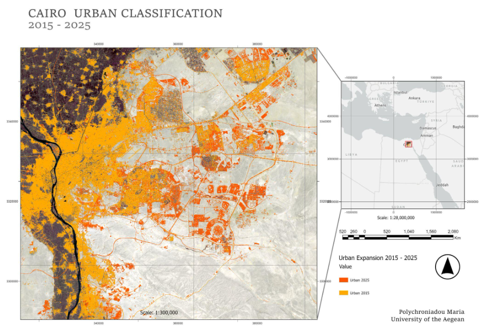

# Cairo-Egypt-Urban-Expansion-2015---2025
A CNN clasification on urban expantion for Cairo between 2015 and 2025. The neural network was created in Matlab

Study area map. The city of Cairo in the year 2015

Study area map. The city of Cairo in the year 2025

Binary Classification of Urban and Non-Urban land, where the orange colour highlights the urban land in the year 2015 and green colour shopws the expansion until 2025.

