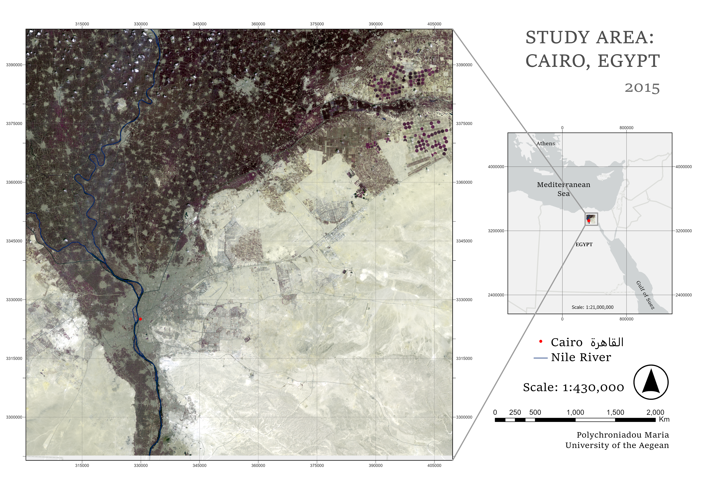
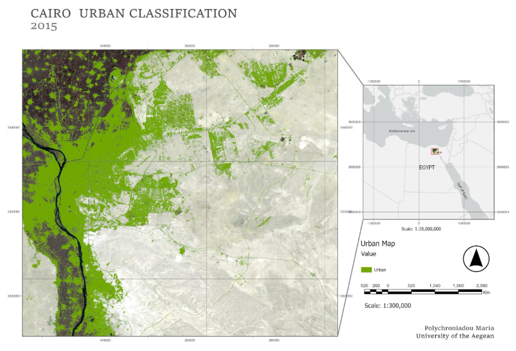
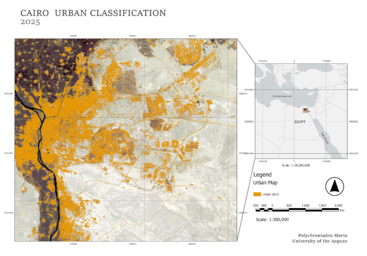

# Cairo Urban Expansion 2015-2025: Binary Classification with a Neural Network

Mapping built-up vs non-built-up land in the Cairo region from Sentinel-2 imagery, using a neural network trained in MATLAB and GIS analysis, to measure urban expansion over a decade.


## Results

### Study area


*Sentinel-2 image, 13 August 2015.*


*Sentinel-2 image, 25 August 2025.*

### 2015 classification


*Built-up areas in green. Overall accuracy 99.0%.*

- Trained for 161 epochs (training 99.1%, validation 99.0%, test 98.7%).
- Validation and test curves stay close to the training curve, and the ROC curves hug the top-left corner. There is no sign of overfitting.

### 2025 classification


*Built-up areas in orange. Overall accuracy 97.0%.*

- Trained for 95 epochs (training 97.0%, validation 96.5%, test 97.2%).
- Slightly lower accuracy than 2015, likely due to a more heterogeneous urban landscape and new land cover types after rapid expansion.

### Urban expansion 2015-2025


*Built-up area in 2015 (orange) and new built-up area by 2025 (red).*

The difference raster shows **~532 km²** of new built-up area, concentrated around the edges of the existing city and in the desert to the east.

## Study area

Peri-urban Cairo, Egypt, one of the fastest-growing metropolises in the world and the most populous city in Africa. The area is highly heterogeneous: dense urban fabric, farmland along the Nile, and desert, which makes land cover mapping challenging.

## Data

- **Imagery:** Sentinel-2A (13 Aug 2015) and Sentinel-2B (25 Aug 2025), downloaded from the Copernicus platform. August scenes were chosen for minimal cloud cover and shadows.
- **Bands:** 9 spectral bands (60 m bands and B8A excluded).
- **Reference system:** WGS 84 / UTM zone 36N (EPSG:32636).
- **Training data:** polygons of built-up and non-built-up areas, digitised in GIS (`Training_Data/`). The same shapefile was used for both years because the sampled areas represent the same class in both.

## Methodology

1. **Training data:** digitised built-up and non-built-up samples in `[QGIS / ArcGIS]` on both images.
2. **Model:** trained a pattern recognition neural network (`patternnet`) in MATLAB, with one hidden layer of 10 neurons, separately for each year.
3. **Tuning:** tested several training/validation/test splits and kept the best-performing one per year (70/20/10 for 2015, 60/20/20 for 2025).
4. **Evaluation:** confusion matrices, ROC curves and performance plots.
5. **Classification:** applied the exported network to the full image with MATLAB code, then checked the result visually in GIS.
6. **Thresholding:** network output split into two classes at a threshold of 80 (≤80 non-built-up, >80 built-up) `[confirm scale]`.
7. **Change detection:** subtracted the two classified rasters with the Raster Calculator, then counted changed pixels and converted them to km² in Python (Spyder).

**Vectorisation:** the MATLAB code was rewritten with matrix and vector operations instead of loops. Classification now runs in seconds rather than hours or days, which made it practical to retrain the network when more training data was needed.

## Results

### 2015
- Trained for 161 epochs, overall accuracy 99.0% (training 99.1%, validation 99.0%, test 98.7%).
- Validation and test curves stayed close to the training curve, and the ROC curves hug the top-left corner. There is no sign of overfitting.

### 2025
- Trained for 95 epochs, overall accuracy 97.0% (training 97.0%, validation 96.5%, test 97.2%).
- Slightly lower accuracy than 2015, likely due to the more heterogeneous urban landscape and new land cover types after rapid expansion.

### Urban expansion
The difference raster shows ~532 km² of new built-up area between 2015 and 2025, concentrated around the edges of the existing urban area and in the desert to the east.

## Error analysis

Despite the high accuracy, visual inspection showed misclassification mainly in **sandy and dune areas** at the edge of the city:
- Bright bare soil and sand can have a spectral signature similar to some building materials.
- Mixed pixels at the boundary between urban, vegetation and desert are hard to separate.
- In the zoomed examples for both years, the errors occur in dune areas, probably because of shadows.

## Limitations and next steps

- Accuracy is measured on a random split of the same training samples. An independent validation set would give a more reliable estimate `[add if you have one]`.
- Only two classes (built-up / non-built-up). A multi-class land cover map would show what land was converted to urban.
- Possible improvements: add spectral indices such as NDBI or NDVI as input features, or add more training samples in sandy areas.

## Tools

MATLAB (Neural Network Toolbox), `[QGIS / ArcGIS]`, Python (Spyder), Copernicus / Sentinel-2.

## Repository structure

```
Matlab-2015/      MATLAB code and trained network, 2015
Matlab-2025/      MATLAB code and trained network, 2025
Plots-2015/       Confusion matrices, ROC curves, performance plots, 2015
Plots-2025/       Same for 2025
Training_Data/    Training samples (shapefile)
```

## Reference

Osman, T., Arima, T. & Divigalpitiya, P. (2016). Measuring Urban Sprawl Patterns in Greater Cairo Metropolitan Region. *Journal of the Indian Society of Remote Sensing*, 44, 287-295. https://doi.org/10.1007/s12524-015-0489-6

*Project developed at the University of the Aegean, Department of Geography.*
